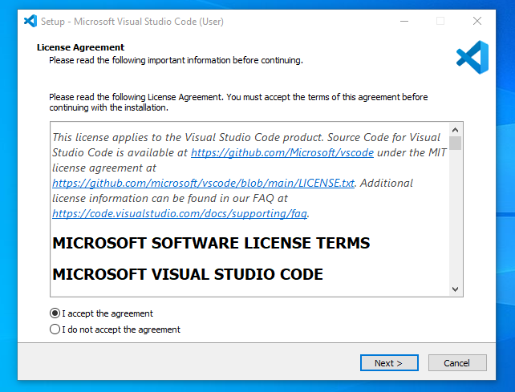
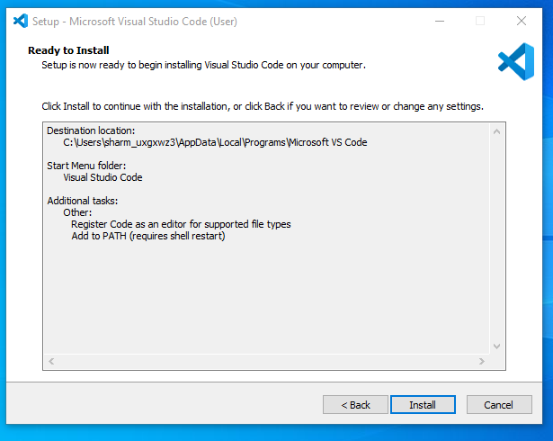

Installing Windows 11
Go to the Windows 11 Download Page. From there, choose the Create Windows 11 Installation Media option. Then follow the steps below:

Step 1: Agree to the terms and choose Accept. Let the Setup tool run, and choose Use the recommended options for this PC. Click Next, and choose USB flash drive.

Step 2: Choose your USB flash drive from the list and then click Next. You'll be prompted and Windows 11 will download to it. Once finished, the installer will switch to Creating Windows 11 Installation media. You'll know when it's finished, as you'll get a prompt that the drive is ready.

Step 3: Once your USB drive is ready, close the installer with the Finish button. Keep the USB drive plugged into your PC.

Step 4: Head back to the Windows 10 settings app, and choose Update & security. Then choose Recovery on the left side. Under Advanced startup, choose the Restart now option.

Step 5: In the pop-up prompt, choose Use a device. Your USB drive should appear listed. Choose it, and Windows will restart to your USB drive and Windows 11 installer.

Step 6: Once in the Windows 11 installer, select a language, and click Next. Pick the version of Windows 11 that matches the version of Windows 10 on your PC. and click Next.

Step 7: Choose the Custom option and choose the drive to install Windows 11 on. You might have to click the Format button to erase all your files on the drive. When done, select the drive again and click Next.

Step 8: Windows 11 will install to your PC, and you can sit back. You'll then be taken to the out-of-box experience, and will be prompted to set up your PC again.

Installing Visual Studio Code
Step 1: Visit the Official Website of the Visual Studio Code using any web browser like Google Chrome, Microsoft Edge, etc.

Step 2: Press the “Download for Windows” button on the website to start the download of the Visual Studio Code Application.

Step 3: When the download finishes, then the Visual Studio Code Icon appears in the downloads folder.

Step 4: Click on the Installer icon to start the installation process of the Visual Studio Code.

Step 5: After the Installer opens, it will ask you to accept the terms and conditions of the Visual Studio Code. Click on I accept the agreement and then click the Next button.

Step 6: Choose the location data for running the Visual Studio Code. It will then ask you to browse the location. Then click on the Next button.

Step 7: Then it will ask to begin the installation setup. Click on the Install button.

Step 8: After clicking on Install, it will take about 1 minute to install the Visual Studio Code on your device.

Step 9: After the Installation setup for Visual Studio Code is finished, it will show a window like this below. Tick the “Launch Visual Studio Code” checkbox and then click Next.

Step 10: After the previous step, the Visual Studio Code window opens successfully. Now you can create a new file in the Visual Studio Code window and choose a language of yours to begin your programming journey!

Installing Python
1. Click on the Downloads tab and then select the Windows option. 

2. This will take you to the page where the different Python releases for Windows can be found. Since I am using a 64bit system, I’ll select “Windows x86-64 executable installer”.

3. Once the executable file download is complete, you can open it to install Python.

4. Click on Run, which will start the installation process.

5. If you want to save the installation file in a different location, click on Customize installation; otherwise, continue with Install Now. Also, select the checkbox at the bottom to Add Python 3.7 to PATH.

6. Once the installation is complete, the below pop-up box will appear: Setup was successful.

Installing MySQL
Step 1: Visit the Official MySQL Website
Open your preferred web browser and navigate to the official MySQL website. Now, Simple click on first download button.

Step 2: Go to the Downloads Section
On the MySQL homepage, Click on the ” No thanks, just start my download” link to proceed MySql downloading.

Step 3: Run the Installer
After MySQL downloading MySQL.exe file , go to your Downloads folder, find the file, and double-click to run the installer.

Step 4: Choose Setup Type
The installer will instruct you to choose the setup type. For most users, the “Developer Default” is suitable. Click “Next” to proceed.

Step 5: Check Requirements
You might be prompted to install necessary MySQL software, typically Visual Code. The installer can auto-resolve some issues, but not in this case.

Step 6: MySQL Downloading
Now that you’re in the download section, click “Execute” to start downloading the components you selected. Wait a few minutes until all items show tick marks, indicating completion, before moving forward.

Step 7: MySqL Installation
Now the downloaded components will be installed. Click “Execute” to start the installation process. MySQL will be installed on your Windows system. Then click Next to proceed

Step 8: Navigate to Few Configuration Pages
Proceed to “Product Configuration” > “Type and Networking” > “Authentication Method” Pages by clicking the “Next” button.

Step 9: Create MySQL Accounts
Create a password for the MySQL root user. Ensure it’s strong and memorable. Click “Next” to proceed.

Step 10: Connect To Server
Enter the root password, click Check. If it says “Connection succeed,” you’ve successfully connected to the server.

Step 11: Complete Installation
Once the installation is complete, click “Finish.” Congratulations! MySQL is now installed on your Windows system.

Step 12: Verify Installation
To ensure a successful installation of MySQL, open the MySQL Command Line Client or MySQL Workbench, both available in your Start Menu. Log in using the root user credentials you set during installation.

Challenges faced during setup
No challenges were faced during the setup of all software.

